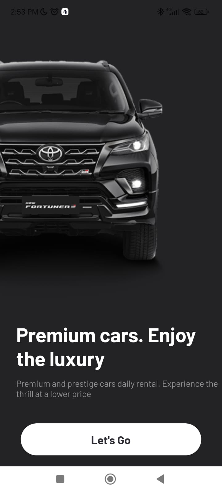
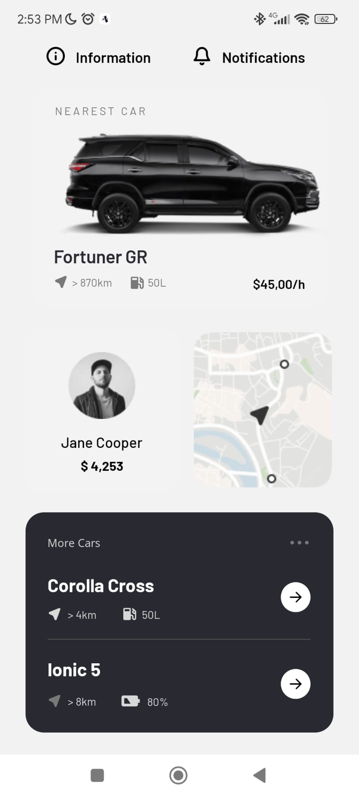
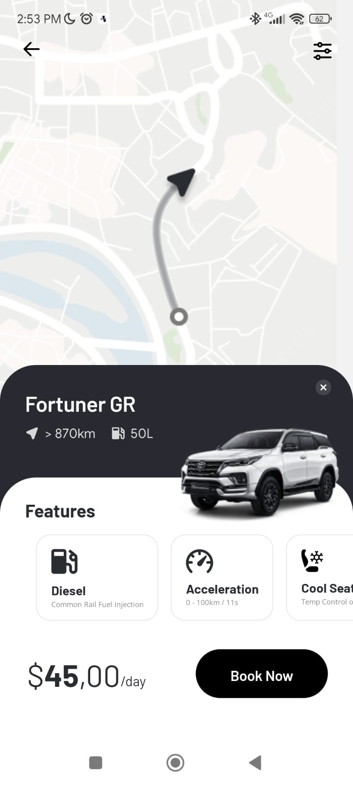
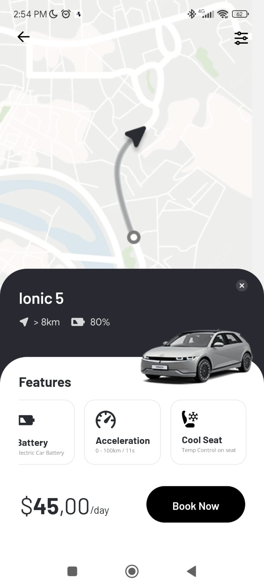

# Car Rent App

## ✉ About

A mobile application for a car rent company, made with Expo, React Native and Typescript.

## 🌆 Images

<div display="flex">
  
  
  
  
</div>

## ⚠ Requirements

In order to run the project, you will need:

- Node
- ExpoCLI
- A mobile device OR a mobile emulator

## 🎨 Figma Design

If you wish to check the app design on figma, click the link below:

[Figma Design](https://www.figma.com/file/TaiWFImZGlhai9MxDYB3ET/Car-Rent-App-(Community))

## 💻 Technologies Used

### MOBILE

- React Native
- Typescript
- Expo

### EDITOR

- Visual Studio Code

## ⬇ How to download the project

```bash

git clone https://github.com/arthur-lage/rent-car-app.git

cd rent-car-app

npm install

expo start # YOU NEED EXPO CLI INSTALLED

```

## 🔗 How to use the app

If you wish to test the application, click the link below:

[app](https://link-to-your-app.com)
